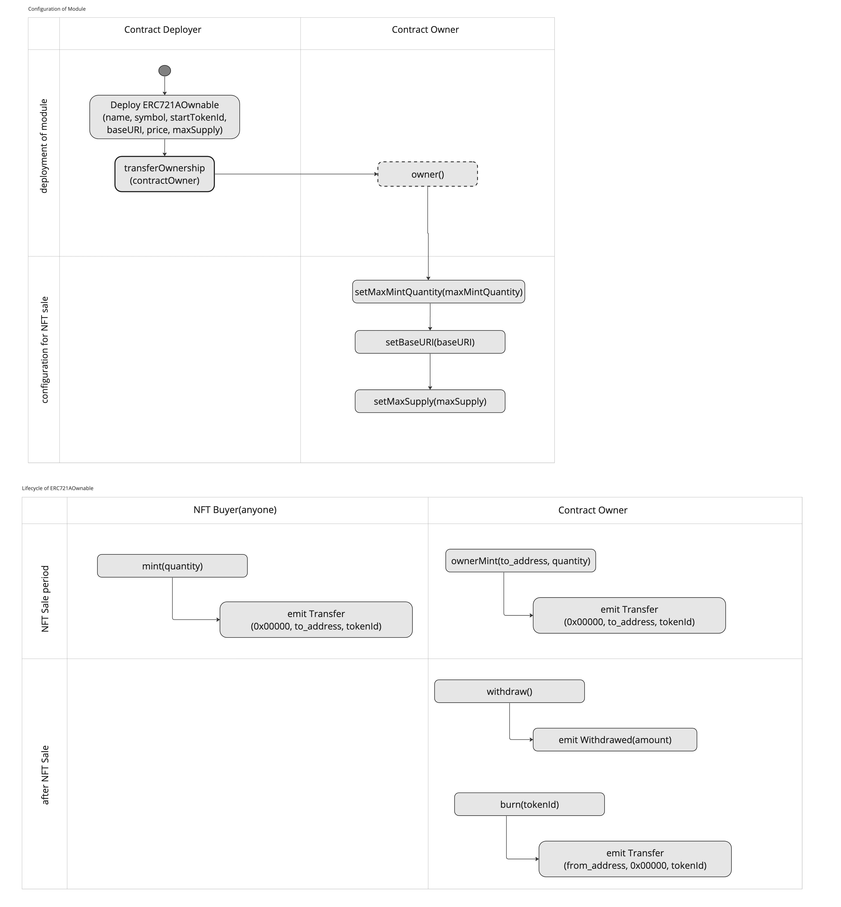

# How To Use

## Before Deployment

1. Owner will decide following NFT features before starting NFT sale.

- `baseURI`
- `price`: price to sell each NFT for investors
- `maxSupply`: The max amount of NFTs |default 10000
- `maxMintQuantity`: the max quantity for one investor to mint NFTs|default 3
- `startTokenId`: tokenId to start counting minted NFTs|usually 0

## Deployment

1. Deploy this contract though Bunzz application deploy button.

2. Input t `he following module parameters when deployment.  
`name`, `symbol`, `startTokenId`, `baseURI`, `price`, `maxSupply`

## Operation to sell NFTs
1. Make sure each configuration is correct. If not, you can update by following functions.
- setBaseURI()
- setCurrentPrice()
- setMaxSupply()

2. anyone can mint up to the maximum amount of token by `mint()` function.

3. Only Owner can mint any arbitrary amount of NFTs from `ownerMint()` function.

4. After the NFT sale is finished, only owner can withdraw the ethereum stored on contact by `withdraw()` function.

## Operation Diagram

