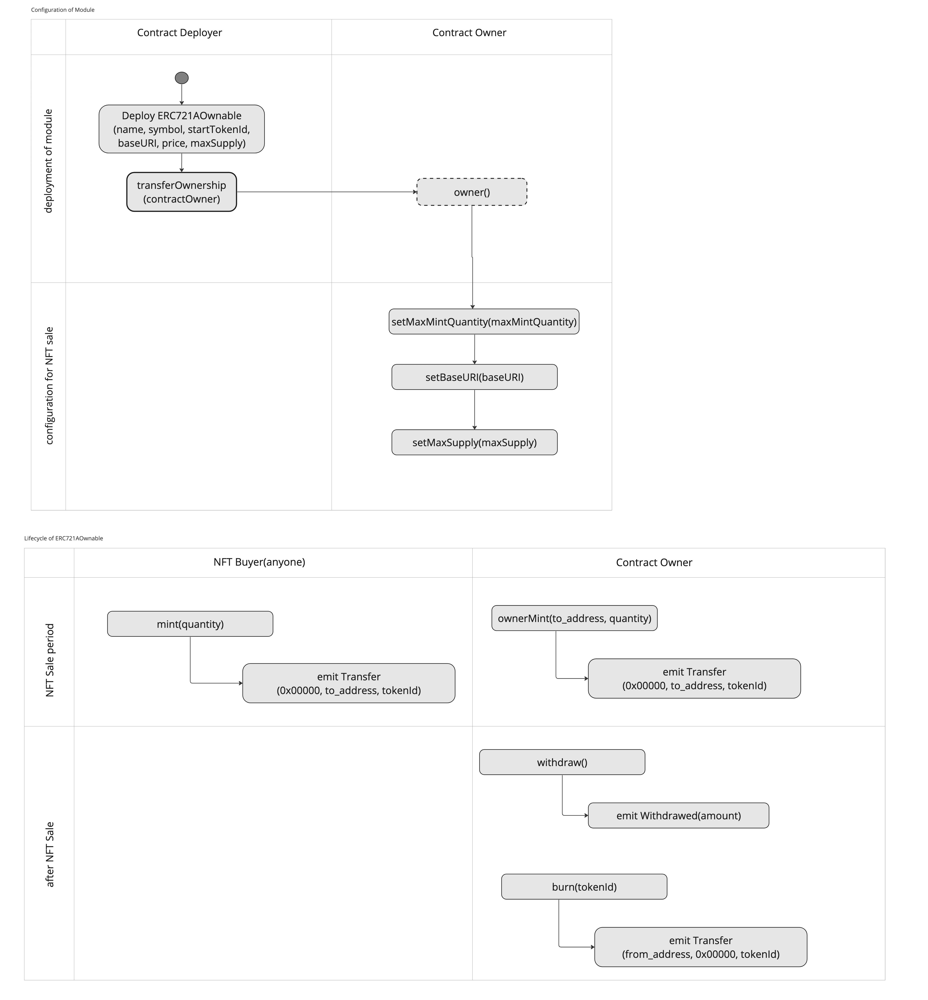

# ERC721AOwnable
# About
> Style: 2-3 lines description  
> Content: What issue does this module solve?

ERC721 Non Fungible Token Standard with gas optimization when minting many NFTs at the same time.

## Tags
> 5-7 keywords about the contract which will later be used for search.
> Content: use-case in the biz term, technical traits

- token
- ERC721
- NFT
- NFT Sale

## Features
> Style: bullet points  
> Content: Who-How-What

"There is no any ready-to-use feature to mention here as it is."

 - [x] NFT sale with an configurable price.
 - [x] Reserve function for the contract owner to mint free NFTs.
 - [x] Fixed maximum supply.
 - [ ] Reduced gas costs when minting NFTs at the same time.
    - once ERC721ABase.sol properly inherits ERC721A, then this feature will be included.

# How To Use

## Before Deployment

1. Owner will decide following NFT features before starting NFT sale.

- `baseURI`
- `price`: price to sell each NFT for investors
- `maxSupply`: The max amount of NFTs |default 10000
- `maxMintQuantity`: the max quantity for one investor to mint NFTs|default 3
- `startTokenId`: tokenId to start counting minted NFTs|usually 0

## Deployment

1. Deploy this contract though Bunzz application deploy button.

2. Input t `he following module parameters when deployment.  
`name`, `symbol`, `startTokenId`, `baseURI`, `price`, `maxSupply`


## Operation to sell NFTs
1. Make sure each configuration is correct. If not, you can update by following functions.
- setBaseURI()
- setCurrentPrice()
- setMaxSupply()

2. anyone can mint up to the maximum amount of token by `mint()` function.

3. Only Owner can mint any arbitrary amount of NFTs from `ownerMint()` function.

4. After the NFT sale is finished, only owner can withdraw the ethereum stored on contact by `withdraw()` function.


## Operation Diagram



# Module Parameters
## ERC721AOwnable

ERC721 contract which the following features
- NFT sale with an configurable price.
- Reserve function for the contract owner to mint free NFTs.
- Fixed maximum supply.

```solidity
constructor(string name_, string symbol_, uint256 startTokenId_, string baseURI_, uint256 price, uint256 maxSupply_) public
```

#### Parameters

| Name | Type | Description |
| ---- | ---- | ----------- |
| name_ | string | NFT Name |
| symbol_ | string | NFT Symbol |
| startTokenId_ | uint256 | the starting number of tokenId |
| baseURI_ | string | basement of URI concatinating with tokenId |
| price | uint256 | the price to sale NFT in Ethereum| precision:18 |
| maxSupply_ | uint256 | the maximum supply of all NFTs |

# Function

## WRITE
### mint

```solidity
function mint(uint256 quantity) public payable
```

anyone can mint the `quantity` of NFT up to `maxMintQuantity`.
Requirements:
- the max mintable qunatitiy for one user is `maxMintQuantity`.
- total quantity of NFT will not be exceed the `maxSupply`.
- sender should pay the exact amount of price * quantity.

#### Parameters

| Name | Type | Description |
| ---- | ---- | ----------- |
| quantity | uint256 | the quantity of minting NFT |

### ownerMint

```solidity
function ownerMint(address to, uint256 quantity) public
```

only contact owner can mint a `quantity` of NFT for free.
Requirements:
- total quantity of NFT will not be exceed the maxSupply.

#### Parameters

| Name | Type | Description |
| ---- | ---- | ----------- |
| to | address | the receiver's wallet address |
| quantity | uint256 | the quantity of minting NFT |


#### Parameters

| Name | Type | Description |
| ---- | ---- | ----------- |
| to | address | the receiver address |
| quantity | uint256 | the quantity of minting NFT |

### burn

```solidity
function burn(uint256 tokenId) public virtual
```

Only contact owner can burn the NFT token by specifing the tokenId.

#### Parameters

| Name | Type | Description |
| ---- | ---- | ----------- |
| tokenId | uint256 | the tokenId of NFT |

### withdraw

```solidity
function withdraw() external
```

A way for the owner to withdraw all proceeds from the sale.

### setBaseURI

```solidity
function setBaseURI(string baseURI_) public
```

Updates the baseURI that will be used to retrieve NFT metadata.

#### Parameters

| Name | Type | Description |
| ---- | ---- | ----------- |
| baseURI_ | string | The baseURI to be used. |

#### Return Values

| Name | Type | Description |
| ---- | ---- | ----------- |
| [0] | string | (string memory) Base URI |

### setMaxSupply

```solidity
function setMaxSupply(uint256 _maxSupply) public
```

Only contract owner can update the total supply of NFTs.

#### Parameters

| Name | Type | Description |
| ---- | ---- | ----------- |
| _maxSupply | uint256 | the quantity of total amount |

### setCurrentPrice

```solidity
function setCurrentPrice(uint256 price) external
```

Sets the price of each NFT during the initial sale.

#### Parameters

| Name | Type | Description |
| ---- | ---- | ----------- |
| price | uint256 | The price of each NFT during the initial sale | precision:18 |


### setMaxMintQuantity

```solidity
function setMaxMintQuantity(uint256 _maxMintQuantity) public
```

Only contract owner can update the maximum quantity for one user to mint NFT.
The default is 3 for one wallet address.

#### Parameters

| Name | Type | Description |
| ---- | ---- | ----------- |
| _maxMintQuantity | uint256 | the maximum quantity of NFTs |

### approve

```solidity
function approve(address to, uint256 tokenId) public
```

See {IERC721-approve}.

### setApprovalForAll

```solidity
function setApprovalForAll(address operator, bool approved) public virtual
```

See {IERC721-setApprovalForAll}.


### transferFrom

```solidity
function transferFrom(address from, address to, uint256 tokenId) public virtual
```

See {IERC721-transferFrom}.

### safeTransferFrom

```solidity
function safeTransferFrom(address from, address to, uint256 tokenId) public virtual
```

See {IERC721-safeTransferFrom}.

## READ
### numberMinted

```solidity
function numberMinted(address owner) public view returns (uint256)
```

return the number of NFT which the owner has minted so far.

#### Parameters

| Name | Type | Description |
| ---- | ---- | ----------- |
| owner | address | the address of NFT owner |

#### Return Values

| Name | Type | Description |
| ---- | ---- | ----------- |
| [0] | uint256 | numberMinted |

### numberBurned

```solidity
function numberBurned(address owner) public view returns (uint256)
```

return the number of NFT which the owner has burned so far.

#### Parameters

| Name | Type | Description |
| ---- | ---- | ----------- |
| owner | address | the address of NFT owner |

#### Return Values

| Name | Type | Description |
| ---- | ---- | ----------- |
| [0] | uint256 | numberBurned |


### getApproved

```solidity
function getApproved(uint256 tokenId) public view returns (address)
```

See {IERC721-getApproved}.

### name

```solidity
function name() public view virtual returns (string)
```

See {IERC721Metadata-name}.

### symbol

```solidity
function symbol() public view virtual returns (string)
```

See {IERC721Metadata-symbol}.

### tokenURI

```solidity
function tokenURI(uint256 tokenId) public view virtual returns (string)
```

See {IERC721Metadata-tokenURI}.

### balanceOf

```solidity
function balanceOf(address owner) public view returns (uint256)
```

See {IERC721-balanceOf}.

### ownerOf

```solidity
function ownerOf(uint256 tokenId) public view returns (address)
```

See {IERC721-ownerOf}.

### baseURI

```solidity
function baseURI() public view returns (string)
```

getter of _baseURI

#### Return Values

| Name | Type | Description |
| ---- | ---- | ----------- |
| [0] | string | _baseURI |

### exists

```solidity
function exists(uint256 tokenId) public view returns (bool)
```

check if the tokenId exists or not.

#### Parameters

| Name | Type | Description |
| ---- | ---- | ----------- |
| tokenId | uint256 | the tokenId of NFT |

#### Return Values

| Name | Type | Description |
| ---- | ---- | ----------- |
| [0] | bool | boolean |

### startTokenId

```solidity
function startTokenId() public view returns (uint256)
```

To change the starting tokenId, please override this function.

#### Return Values

| Name | Type | Description |
| ---- | ---- | ----------- |
| [0] | uint256 | (uint256) Start Token ID |

### totalSupply

```solidity
function totalSupply() public view returns (uint256)
```

Burned tokens are calculated here, use `_totalMinted()` if you want to count just minted tokens.

#### Return Values

| Name | Type | Description |
| ---- | ---- | ----------- |
| [0] | uint256 | (uint256) Total supply |

### supportsInterface

```solidity
function supportsInterface(bytes4 interfaceId) public view virtual returns (bool)
```

See {IERC165-supportsInterface}.

### isApprovedForAll

```solidity
function isApprovedForAll(address owner, address operator) public view virtual returns (bool)
```

See {IERC721-isApprovedForAll}.

### totalMinted

```solidity
function totalMinted() public view returns (uint256)
```

return the number of all minted tokens without considering burned tokens.

# Event

### Transfer
Emitted when `tokenId` token is transferred from `from` to `to`.

``` solidity
event Transfer(address indexed from, address indexed to, uint256 indexed tokenId);
```

### Approval
Emitted when `owner` enables `approved` to manage the `tokenId` token.

``` solidity
event Approval(address indexed owner, address indexed approved, uint256 indexed tokenId);
```

### ApprovalForAll
Emitted when `owner` enables or disables (`approved`) `operator` to manage all of its assets.

``` solidity
event ApprovalForAll(address indexed owner, address indexed operator, bool approved);
```

### OwnershipTransferred